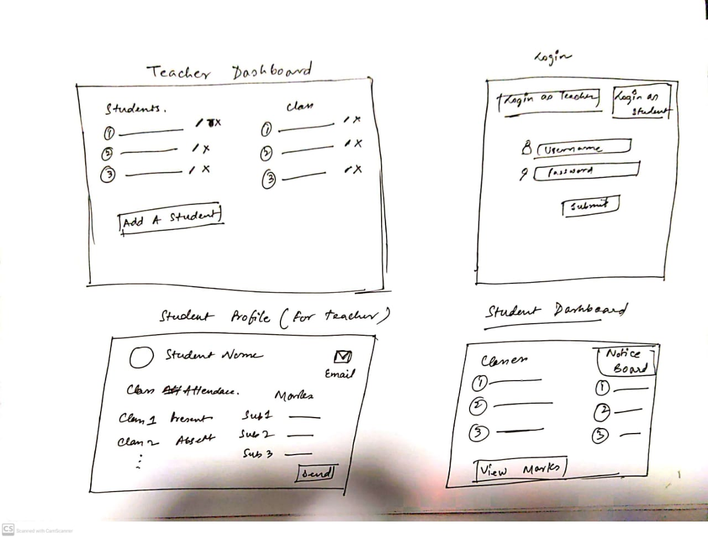
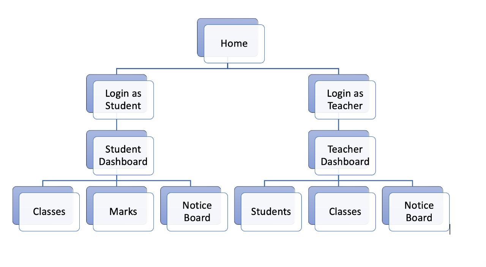

# Student Management System :man_student:

## Overview

This system is responsible for managing all the students and teacher relationship. This will help teachers to update all the details in the database and can electronically manage all the details of a student. This can have bigger upgradations like applying analytics and sending proper notifications to parents in order to guide them about their child.
This system will have features such as attendance management, marks management and other miscellaneous features like documents or notes upload and downloading as well as getting access to email the marks of a student to the payment and also sending email notifications to parents regarding any information. This system will also have notice board where the teacher can add notices and students can view them.

## Data Model

The Application will store students, teachers, parents and their details.

An example student object
```javascript
var student = {
name: XYZ,
subject: Database,
class: AIT,
parent name: ABC,
contact: 123345123
}
```

A sample teacher object
```javascript
var teacher = {
name: IJK,
subject: DEF,
contact: 24534612345
}
```

## Wireframe



## Sitemap


## List of user stories:

### Teacher

1. Login / Register
2. Add, Edit, Delete, View Students
3. Add, Delete, View Classes
4. Add Students to the classes
5. Mark the student attendance
6. Update the marks of the students
7. Email the parents, marks of the students
8. Add, Edit, Delete, View the notice from the notice board

### Student

1. Login with the credentials provided by the teacher
2. View the classes and their attendance in that
3. View the marks given to them
4. View the notices